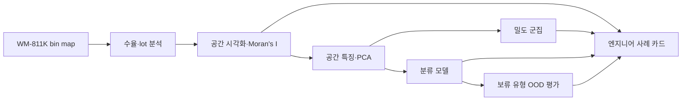
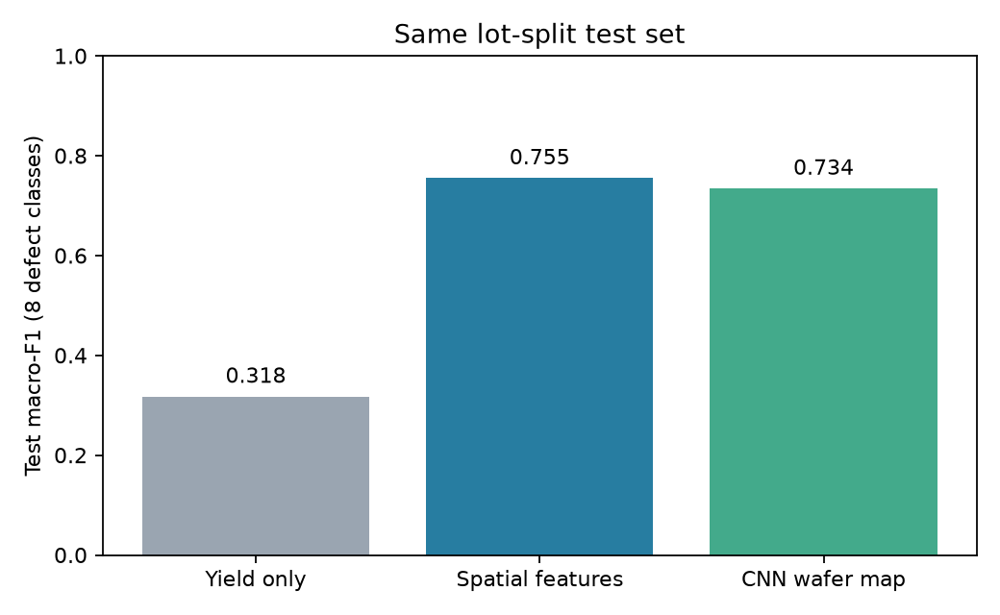

# 웨이퍼 수율·불량 패턴 분석 — 프로젝트 결과

[웹사이트에서 보기](https://changjunpark-gif.github.io/Semiconductor/)

WM-811K wafer bin map **811,457장 / 46,293 lot**을 대상으로, 수율 집계부터 공간 통계·특징 추출·군집·분류·신규 패턴 탐지까지 재현 가능한 분석 흐름을 만들었다. 전공정 공정·수율 엔지니어 지원 시 강조할 부분은 특정 모델의 높은 정확도가 아니라 **lot 분할로 누출을 줄이고, 공간적 결함을 수치화하며, 실패 사례를 공정 검토 질문으로 바꾼 과정**이다.



## 핵심 결과

| 질문 | 검증한 결과 | 해석 |
| :--- | :--- | :--- |
| 수율만으로 결함 형태를 구별할 수 있나? | 같은 8종 결함·같은 lot 분할 test에서 yield-only macro-F1 **0.318** | 수율 하나로는 형태 구별이 어렵다. |
| 공간 특징을 추가하면? | 특징 기반 로지스틱 회귀 **0.755**, wafer map CNN **0.734** | 공간 정보가 유용했다. 이 실험에서는 작은 CNN이 기준선을 넘지 못했다. |
| 군집이 결함 유형을 자동으로 찾나? | HDBSCAN 표본에서 라벨 결함 360장 중 **341장(94.7%)**이 noise | 밀도 군집의 noise를 신규 결함 유형으로 간주할 수 없다. |
| 처음 보는 유형을 경보할 수 있나? | 보류 8종 OOD: Mahalanobis 평균 AUROC **0.780**, validation 임계값의 평균 탐지율 **36.5%** / 알려진 유형 오경보율 **4.3%** | 순위 성능은 있으나 실제 경보 기준의 놓침이 크다. |

분류 비교는 `none`·미라벨을 제외한 결함 8종, 원본 map의 분할 간 완전 중복 제거 후 **test 3,637장**에서 수행했다. 수율 기준선도 원래의 train/test를 그대로 사용하고 test로 하이퍼파라미터를 고르지 않았다. 공간 특징 기준선에는 수율에 대응하는 `fail_rate`를 포함하므로, 차이는 **수율 단독 대비 공간 특징을 추가한 효과**로 읽어야 한다. [비교 코드](src/evaluation/step8_yield_baseline.py) · [수치](reports/step8_model_comparison.csv) · [6단계 세부 지표](reports/step6_classification.md)



## 엔지니어가 검토할 사례

[사례 카드](reports/portfolio_case_cards.md)는 lot 내 급격한 수율 저하, 가장자리 패턴의 분류 혼동, 검출된/놓친 보류 패턴을 **관찰 → 가능한 확인 항목 → 현재 데이터로는 결론낼 수 없는 것**으로 나눴다. 이 데이터에는 장비·공정 조건, 시간, 층별 계측값이 없어서 결함의 공정 원인이나 수율 개선 효과를 주장하지 않는다.

## 재현과 발표

1. [명세서](PROJECT_SPEC.md)와 [단계별 진행표](PROJECT_PROGRESS.md)를 확인한다.
2. [README](README.md)의 단계별 명령으로 원본 데이터를 로컬 `data/raw/`에 놓고 분석한다. 큰 원본·중간 데이터·모델 체크포인트는 Git에 올리지 않는다.
3. 최종 수율 기준선은 아래 명령으로 재현한다. 1~7단계 산출물이 먼저 필요하다.

```powershell
.\.venv\Scripts\python.exe -m src.evaluation.step8_yield_baseline
```

[발표용 8장 구성과 말하기 메모](PRESENTATION.md)는 면접에서 관찰 사실, 모델 한계, 후속 공정 검증을 구분해 설명할 수 있게 정리했다. 이 저장소의 결과는 공개 wafer bin map 한 출처에서 얻었으며 다른 라인·장비·시점으로 일반화되는지 검증하지 못했다.
