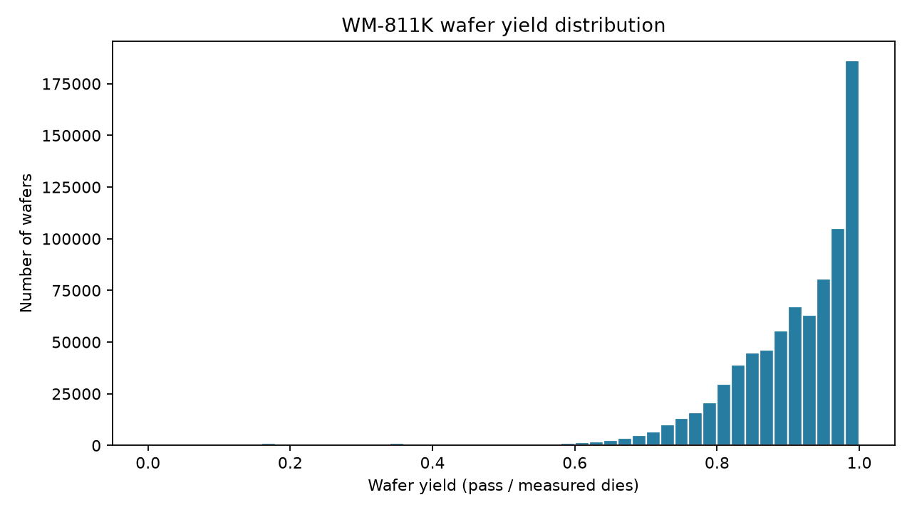
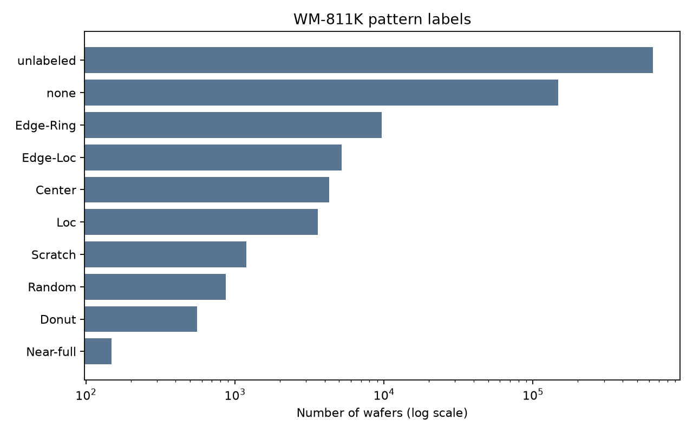

# Step 1 · WM-811K 데이터 품질과 수율·bin 분포

- 데이터 출처: [WM-811K](https://www.kaggle.com/datasets/qingyi/wm811k-wafer-map)
- 원본 파일: `data/raw/LSWMD.pkl` (2,095,505,977 bytes)
- SHA-256: `1d04fccb3dd3176b276878b926b20fead7e077c5751e4d353ea9741a5e7b5c65`
- 원본 행: **811,457**
- 분석 가능한 wafer: **811,457**
- 고유 lot: **46,293**

## 상태 코드와 계산식

| 원본 코드 | 의미 | 수율 분모 포함 |
| :--- | :--- | :--- |
| 0 | wafer 바깥 또는 분석에서 제외한 die | 아니오 |
| 1 | pass | 예 |
| 2 | fail | 예 |

`wafer yield = pass_dies / (pass_dies + fail_dies)`. 유효 die가 없는 map은 분석에서 제외했다. 원본의 `dieSize`와 유효 die 개수를 비교했다.

## 전체 bin 분포

| Bin | Die 수 | 전체 격자 대비 |
| :--- | ---: | ---: |
| outside (0) | 422,404,108 | 22.04% |
| pass (1) | 1,393,453,681 | 72.72% |
| fail (2) | 100,437,508 | 5.24% |

측정된 die 중 pass 비율은 **93.28%**다. 이는 wafer별 yield의 평균과 다른, die 수로 가중된 전체 비율이다.

## Wafer yield 분포

- 평균 wafer yield: **90.31%**
- 중앙값: **92.89%**
- 최소 / 5% / 25% / 50% / 75% / 95% / 최대: **0.00% / 73.40% / 85.77% / 92.89% / 97.68% / 100.00% / 100.00%**

## 라벨 분포와 yield

| 패턴 | wafer 수 | 평균 wafer yield |
| :--- | ---: | ---: |
| unlabeled | 638,507 | 90.87% |
| none | 147,431 | 89.44% |
| Edge-Ring | 9,680 | 84.87% |
| Edge-Loc | 5,189 | 81.72% |
| Center | 4,294 | 76.75% |
| Loc | 3,593 | 85.00% |
| Scratch | 1,193 | 89.94% |
| Random | 866 | 51.94% |
| Donut | 555 | 72.32% |
| Near-full | 149 | 12.31% |

## 품질 점검

- 제외 wafer: **0** ({})
- `dieSize`와 유효 die 수 불일치/결측: **0**
- lot ID 결측: **0**
- waferIndex 결측: **0**
- 중복 `(lot_id, wafer_index)` 키: **0** (원본 행 번호로 구별)
- 원본 `trianTestLabel` 분포: **{'Training': 54355, 'unlabeled': 638507, 'Test': 118595}**
- 가장 많은 map 크기 5종: **[((32, 29), 108687), ((25, 27), 64083), ((49, 39), 39323), ((26, 26), 30078), ((30, 34), 29513)]**

## 생성 파일

- `data/processed/wafer_yield.csv`: wafer별 die 수·수율·라벨
- `data/processed/lot_yield.csv`: lot별 평균 wafer yield와 die 가중 수율
- `reports/label_yield.csv`: 라벨별 샘플 수와 수율
- `reports/figures/`: 보고서 그림

> [!NOTE]
> 공개 데이터의 패턴 라벨은 일부 wafer에만 있다. lot·라벨별 수율 차이는 공정 원인을 뜻하지 않으며, 다음 단계의 공간 분석을 위한 탐색 결과다.
