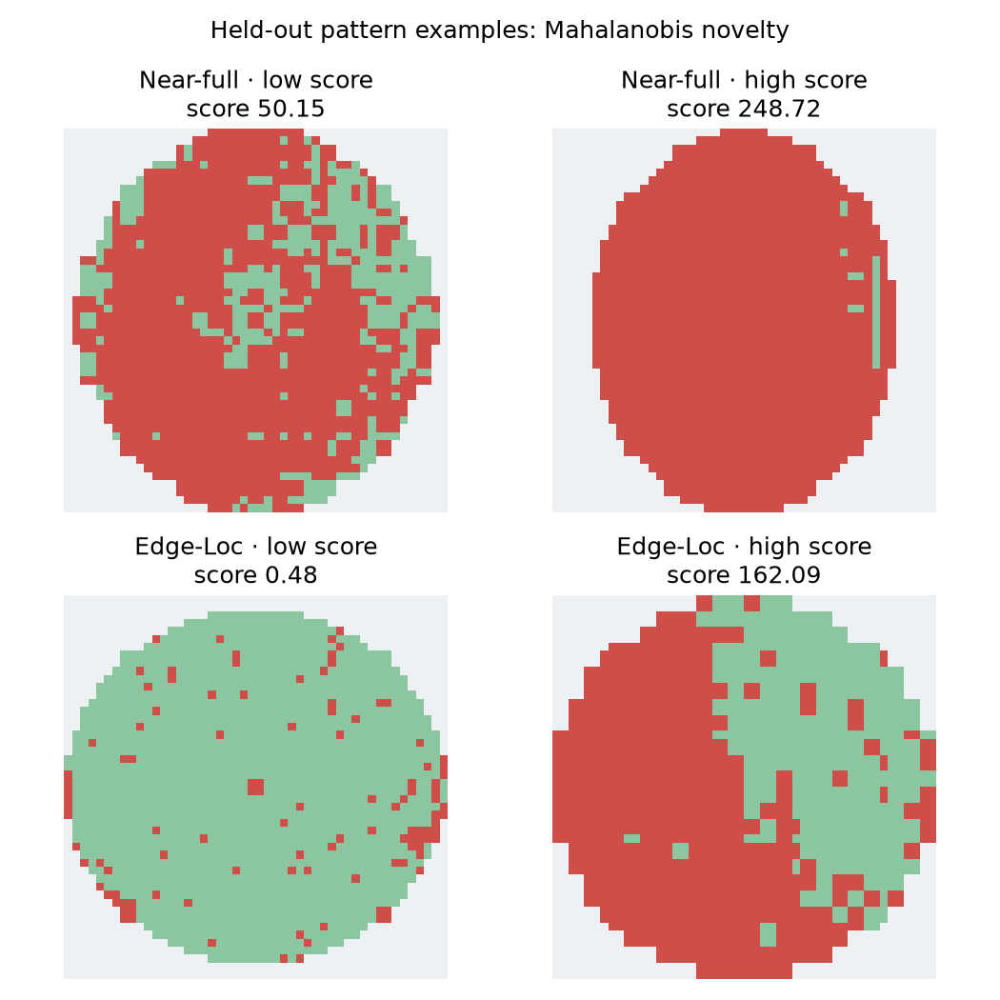

# 공정 엔지니어 검토 사례 카드

이 카드는 **조사 우선순위를 정하기 위한 관찰 기록**이다. WM-811K에는 전공정 장비 이력·레시피·계측·시간 정보가 없어 원인 확정이나 수율 개선 효과를 말할 수 없다. `source_row`는 이 저장소가 사용한 원본 pickle의 0부터 시작하는 행 번호다.

## 1. 같은 lot 안의 급격한 단일 wafer 수율 저하

- **근거:** `lot8392`의 wafer index 12, `source_row=127606`, 수율 **0.17%**. 시각화에 선정된 같은 lot의 다른 11장 중앙 수율은 **98.59%**다. [선정 인덱스](step2_case_index.csv)
- **관찰:** lot 단위 평균만 보면 놓치기 쉬운 wafer 단위 이상이다. 원본 map의 die 상태를 재확인할 가치가 있다.
- **다음 확인:** 측정 데이터·bin 코드 정의와 재측정 여부를 먼저 확인하고, wafer 순서·장비·챔버·레시피·공정 시간 기록과 대조한다. 인접 wafer의 동일 패턴 반복 여부도 확인한다.
- **현재 결론의 경계:** 공개 bin map만으로 공정 불량과 측정/데이터 오류를 구분할 수 없다.

## 2. 가장자리 결함 유형의 분류 혼동

- **근거:** test `source_row=542410`의 라벨은 `Edge-Ring`인데 CNN은 `Edge-Loc`으로 분류했다(확신도 **0.917**). 특징 기반 기준선도 `Edge-Loc`으로 분류했다. [test 예측](step6_test_predictions.csv)
- **관찰:** Edge-Ring과 Edge-Loc은 가장자리 fail을 공유한다. 오류 갤러리에도 같은 방향의 혼동이 반복된다.
- **다음 확인:** 두 라벨의 판정 기준, 결함의 둘레 연속성·각도 범위·영역별 fail 비율을 원본 격자에서 비교한다. 라벨 판정자의 재검토와 해당 lot의 다른 wafer 확인이 유용하다.
- **현재 결론의 경계:** 높은 모델 확신도는 라벨 오류나 특정 공정 원인을 증명하지 않는다.

## 3. 보류 유형을 검출한 사례와 놓치기 쉬운 사례

- **검출 쪽:** `Near-full` 보류 실험의 `source_row=809008`은 Mahalanobis 신규성 점수 **248.72**였다. 이 유형의 test 17장은 validation으로 정한 임계값에서 모두 검출됐지만 표본이 매우 작다.
- **놓침 쪽:** `Edge-Loc` 보류 실험의 `source_row=774654`는 점수 **0.48**로 알려진 패턴과 가까웠다. Edge-Loc 전체 보류 test 788장의 탐지율은 **8.5%**에 그쳤다. [OOD 상세 결과](step7_ood_metrics.csv) · [사례 인덱스](step7_ood_cases.csv)
- **다음 확인:** 검출 사례는 물리적 결함 확인과 유사한 과거 lot 탐색으로 이어가고, 낮은 점수 사례는 기존 클래스와의 공간 특징 중첩을 살핀다. 새로운 패턴 경보에는 정상·미라벨 wafer의 오경보 평가도 추가해야 한다.
- **현재 결론의 경계:** 보류 라벨은 실험상 '처음 보는 유형'일 뿐 실제 신종 공정 결함의 증거는 아니다.

