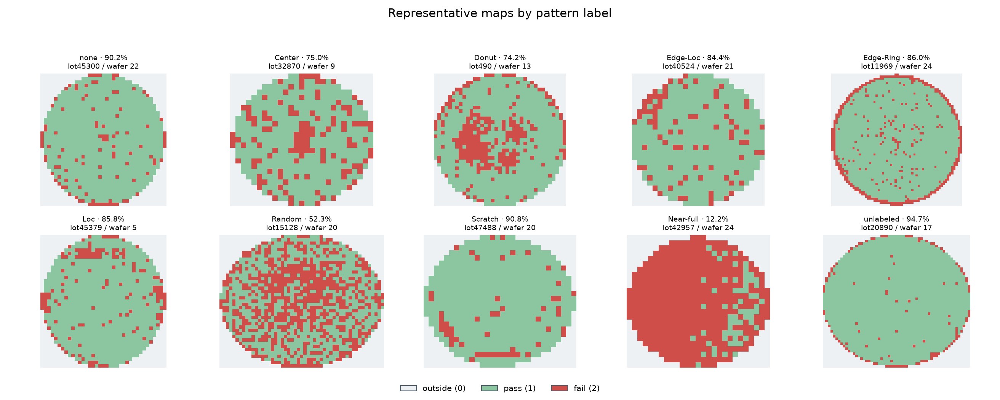
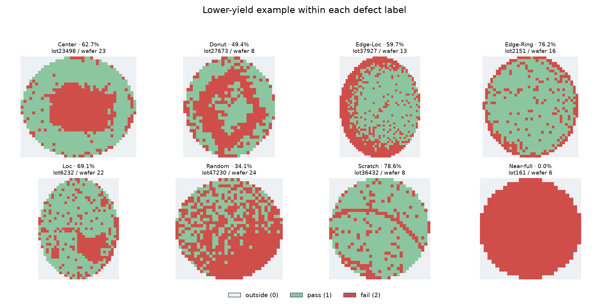
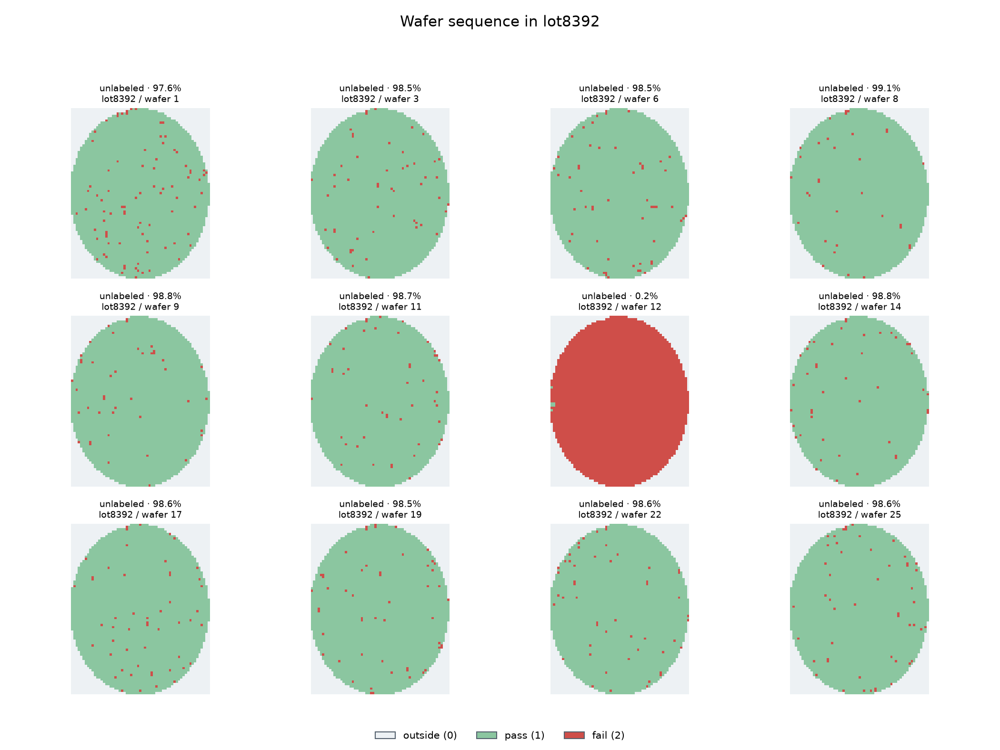

# Step 2 · wafer 공간 시각화

원본 격자를 유지한 wafer map으로 상태 코드 0/1/2를 서로 다른 색으로 표시했다. 그림은 분석용 PNG이며, 분류 모델 입력을 위한 리사이즈는 아직 수행하지 않았다.

## 색상 및 해석

| 값 | 색상 | 의미 |
| :--- | :--- | :--- |
| 0 | 연회색 | wafer 바깥 |
| 1 | 녹색 | pass die |
| 2 | 적색 | fail die |

각 그림은 `interpolation='nearest'`를 사용해 die를 흐리게 보간하지 않는다. 가로·세로 비율은 원본 map을 따른다. 바깥 영역은 fail로 칠하지 않는다.

## 패턴별 대표 map

각 라벨의 wafer yield 중앙값에 가장 가까운 실제 wafer 한 장씩을 골랐다. 여기에는 패턴 없음(`none`)과 미라벨(`unlabeled`)이 포함된다.

## 낮은 수율 사례

8개 불량 라벨에서 각각 수율 5백분위수에 가까운 wafer를 골랐다. 같은 라벨 내부에서도 fail die의 양과 형태가 달라지는지 비교한다.

## lot 내 wafer 순서

15장 이상인 lot 가운데 수율 범위가 가장 큰 **lot8392**을 선택했다. 이 lot의 총 wafer 수는 **25장**, 최저·최고 수율은 **0.2% / 99.1%**다. wafer index 순서에 따라 최대 12장을 추출하되 최저·최고 수율 wafer를 반드시 포함했다.

특히 wafer **12**의 수율은 **0.2%**로 같은 lot의 다른 wafer와 크게 다르다. 이는 후속 조사 우선순위를 정할 사례이며, 원인은 공정 이력 없이 특정할 수 없다.

## 재현성과 품질 점검

- 원본 811,457장 중 대표 10장, 라벨별 저수율 8장, lot 순서 12장을 선택했다.
- 선정 근거와 원본 행 번호는 [사례 인덱스](step2_case_index.csv)에 기록했다.
- 모든 선택은 1단계 wafer별 CSV로 결정하고, 그림은 해당 원본 `waferMap`에서 직접 만들었다.
- 그림 작성 전에 각 map이 2차원이며 상태값이 0/1/2뿐인지 다시 검증했다.

> [!NOTE]
> lot 내 모양의 유사성은 원인에 대한 가설을 만드는 단서일 뿐이다. 공정 이력 없이 장비 또는 공정 단계를 특정하지 않는다.
