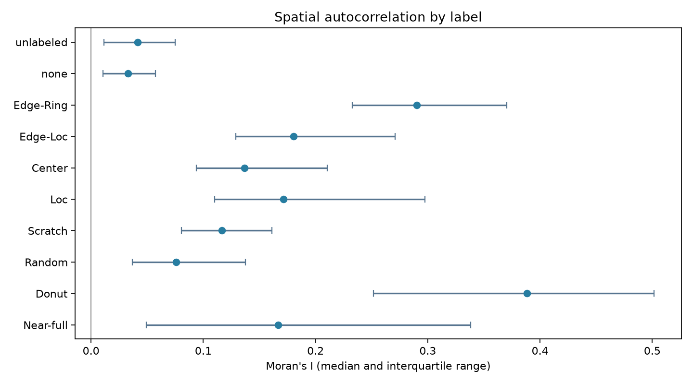
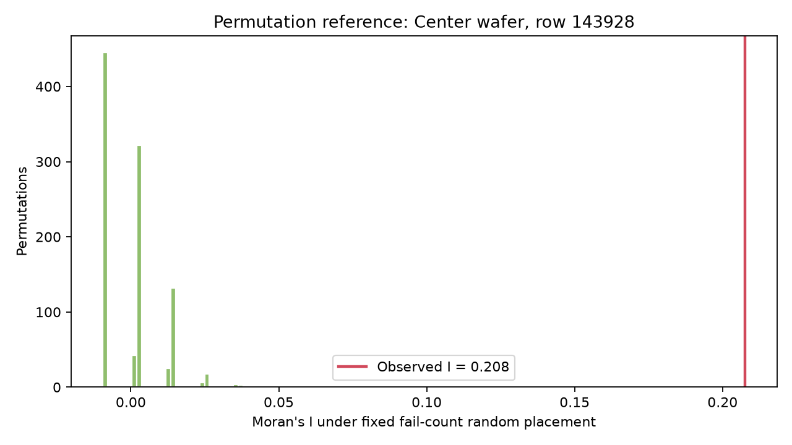

# Step 3 · Moran's I와 공간 자기상관

## 분석 범위와 계산

- 전체 **811,457장**에 global Moran's I와 fail-fail 이웃 쌍 수를 계산했다.
- 원본 상태 0은 제외하고, 상태 1/2인 die만 4방향 상하좌우 인접 그래프의 노드로 사용했다.
- fail을 1, pass를 0으로 두었다. Moran's I가 양수이면 비슷한 상태가 이웃할 경향이 있다는 뜻이다.
- fail이 하나도 없거나 모든 유효 die가 fail인 wafer는 분산이 0이므로 Moran's I를 정의하지 않았다.
- 999회 조건부 permutation은 전체가 아니라 라벨별 수율 범위에서 고른 **51장**에 적용했다. 각 wafer의 mask와 fail die 수를 고정해 실제 배치와 비교했다.

## 전체 결과

- Moran's I 정의 가능: **752,790 / 811,457장**
- 전체 중앙값: **0.041**; 25–75백분위: **0.012–0.075**
- fail-fail join count는 관찰된 이웃 fail 쌍이며, `expected_fail_fail_edges`는 동일한 fail die 수를 무작위로 놓았을 때의 기대값이다.

| 라벨 | wafer 수 | 정의 가능 | Moran's I 중앙값 | 25–75백분위 |
| :--- | ---: | ---: | ---: | ---: |
| unlabeled | 638,507 | 579,855 | 0.041 | 0.011–0.075 |
| none | 147,431 | 147,430 | 0.033 | 0.010–0.057 |
| Edge-Ring | 9,680 | 9,680 | 0.290 | 0.233–0.370 |
| Edge-Loc | 5,189 | 5,189 | 0.180 | 0.129–0.271 |
| Center | 4,294 | 4,294 | 0.137 | 0.094–0.210 |
| Loc | 3,593 | 3,593 | 0.171 | 0.110–0.297 |
| Scratch | 1,193 | 1,193 | 0.117 | 0.081–0.161 |
| Random | 866 | 866 | 0.076 | 0.037–0.138 |
| Donut | 555 | 555 | 0.388 | 0.252–0.501 |
| Near-full | 149 | 135 | 0.167 | 0.049–0.338 |

## 조건부 무작위화 사례

- 사례 **51장** 중 **45장**이 양의 공간 자기상관에 대한 오른쪽 단측 permutation p-value ≤ 0.05였다.
- 사례는 라벨과 수율을 기준으로 의도적으로 선정했으므로 이 비율을 전체 wafer의 유의 비율로 해석하지 않는다.
- p-value는 사전에 정한 양의 자기상관 가설에 대한 값이다. 양·음 모두를 보려면 별도 기록한 `p_two_sided`를 사용한다.
- [사례별 permutation 결과](moran_permutation_cases.csv)에 관찰값, p-value, 귀무분포 대비 z-score를 남겼다.

## 검증과 해석 한계

- 4×4 격자의 이진 checkerboard는 Moran's I = −1, 좌·우 반반 군집은 양수, 상수 map은 undefined로 확인했다.
- 전체 계산 결과는 `data/processed/wafer_spatial.csv`에 보관하고 Git에는 올리지 않는다.
- Moran's I는 공간적 유사성을 요약하지만 edge-ring, center, scratch를 단독으로 구별하지는 못한다. 다음 단계의 반경·방향·연결 성분 특징과 결합한다.
- p-value는 같은 wafer 내 무작위 배치와의 차이를 나타낼 뿐, 특정 공정 원인을 증명하지 않는다.

참고: [PySAL Moran's I 설명](https://pysal.org/esda/stable/user-guide/global_morans_i.html)
