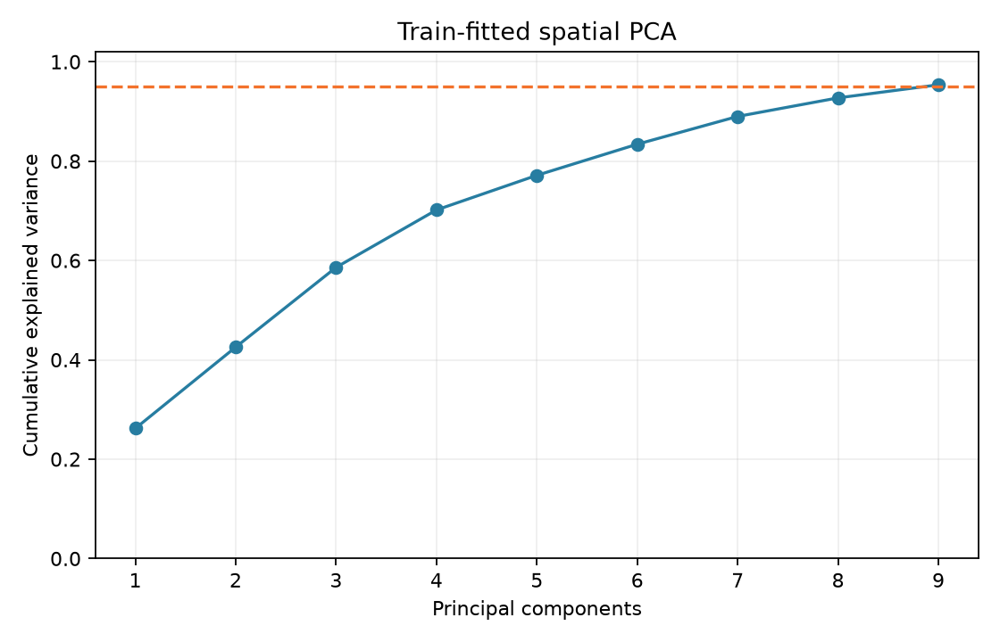
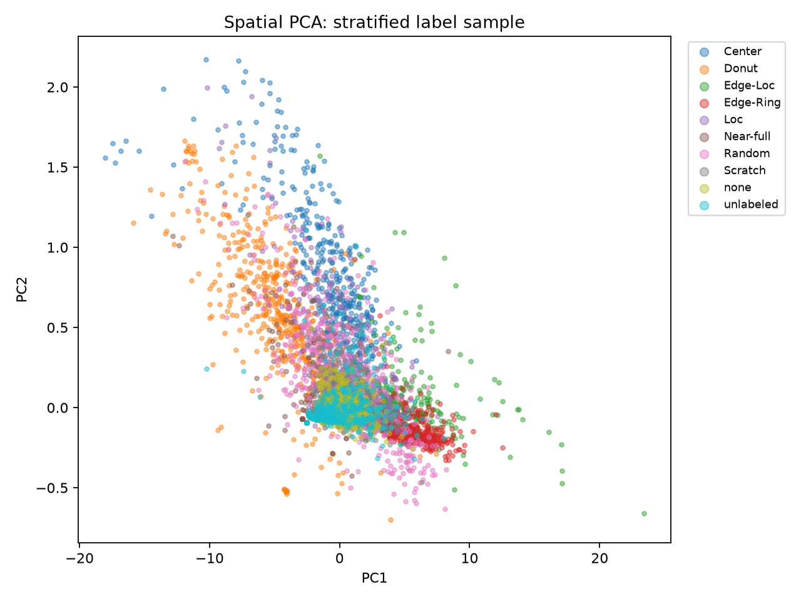

# Step 4 · 공간 특징 추출과 PCA

## 특징 정의

변수별 계산식과 PCA 사용 여부는 [특징 사전](feature_dictionary.md)을 참조한다.

- 전체 **811,457장**에서 수율, 중심·가장자리·반경별 fail rate, 사분면 비대칭, 연결 성분, Moran's I 및 fail-fail 이웃 초과량을 계산했다.
- 반경은 map 중심에서 세로·가로 반지름으로 정규화했다. 중심은 반경 < 0.35, 가장자리는 반경 ≥ 0.75다.
- 각 영역의 fail rate는 해당 영역의 유효 die를 분모로 쓴다. enrichment는 영역 fail rate에서 wafer 전체 fail rate를 뺀 값이다.
- 사분면 비대칭은 네 사분면 fail rate의 최대−최소다. 연결 성분은 fail die의 4방향 인접을 사용한다.
- `moran_i`가 정의되지 않는 상수 map은 결측으로 보존한 뒤 train 중앙값으로 대체하고, PCA 입력에 결측 지시자를 추가한다.
- permutation null z-score는 3단계에서 선정한 사례에만 있어 전체 PCA 입력에는 넣지 않았다. 대신 Moran's I와 관찰−기대 fail-fail edge 비율을 넣었다.

## 누출 방지와 split

- 고유 lot을 시드 42로 섞어 **lot 수 기준 70/15/15**로 train/validation/test에 배정했다. 세 세트의 lot 교집합은 0이다.
- 원본 `trianTestLabel`은 lot 단위 분할이 보장되지 않아 모델링 split에 사용하지 않았다.
- 결측 중앙값, 표준화 평균·분산, PCA 축은 **train wafer만** 사용해 적합했다. validation/test는 같은 파이프라인으로 변환만 했다.
- 라벨 `failure_type`과 수율 `yield`은 분석 표에 보존하지만 PCA 입력에는 넣지 않았다. 공간 enrichment와 연결성·Moran 지표만 PCA 입력에 사용했다.

| Split | Lot 수 | Wafer 수 |
| :--- | ---: | ---: |
| train | 32,405 | 567,823 |
| validation | 6,944 | 121,258 |
| test | 6,944 | 122,376 |

## PCA 결과

- 공간 특징 **11개**와 결측 지시자를 표준화했다.
- train 설명 분산 95%에 도달하는 주성분 수: **9개**.
- PC1 설명 분산: **26.2%**.
- PC1과 wafer yield의 전체 Pearson 상관: **-0.434**. 수율 자체를 PCA 입력에서 제외했어도 공간 특징과 수율이 연관될 수 있다.
- PC1 절대 적재량 상위 5개: **ring_3_enrichment, edge_enrichment, ring_2_enrichment, ring_1_enrichment, component_count_per_1000_valid**.

## 생성 파일과 다음 단계

- `data/processed/wafer_features.csv`: 전체 특징·라벨·lot split
- `data/processed/lot_split.csv`: lot별 고정 split
- `data/processed/pca_embedding.npy`, `pca_pipeline.joblib`: 후속 군집용 임베딩과 train에 적합한 변환기
- [PCA 적재량](pca_loadings.csv), [설명 분산](pca_variance.csv), [라벨별 split 수](label_split_counts.csv)

> [!NOTE]
> PCA는 패턴을 분리해 준다는 보장이 없다. 군집 단계에서는 수율만으로 무리가 나뉘는지와 라벨별 대표 map이 일관되는지 따로 검토한다.
