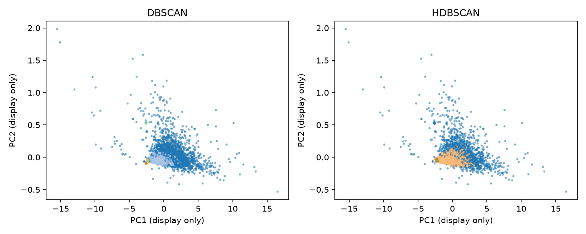
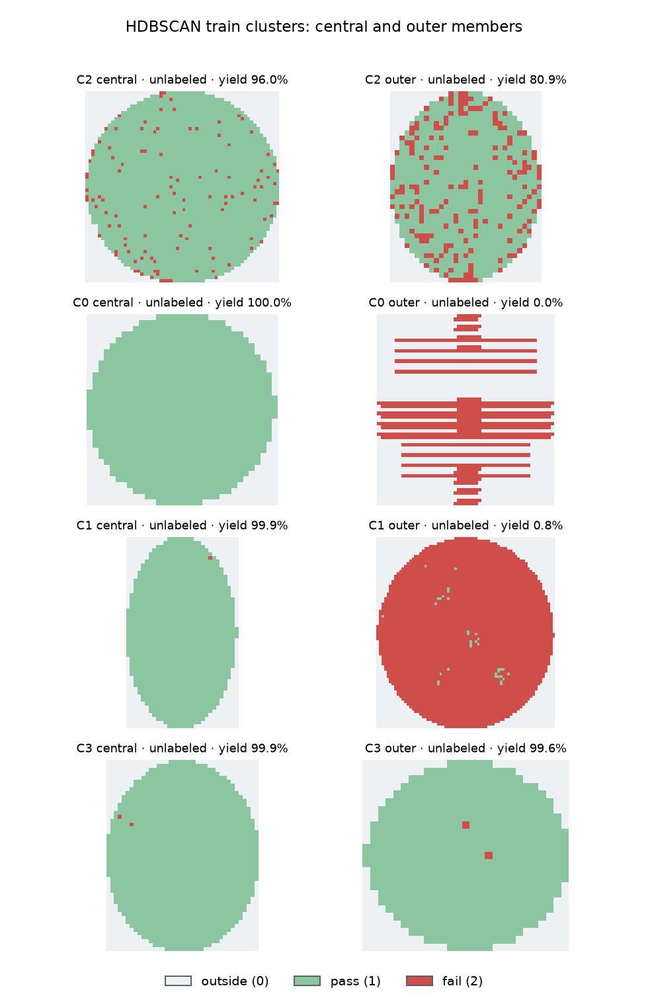

# Step 5 · DBSCAN과 HDBSCAN 패턴 군집

학습 lot의 wafer **12,000장**을 시드 42로 단순 무작위 추출했다. 4단계에서 train에만 적합한 **9차원 PCA 벡터 전체**로 군집화했다. PC1·PC2 그림은 표시용이며 군집 입력을 2차원으로 줄이지 않았다.

## 방법·재현

```powershell
.\.venv\Scripts\python.exe -m pip install -r requirements-step5.txt
.\.venv\Scripts\python.exe -m src.clustering.step5_cluster
```

- DBSCAN: 15번째 이웃 거리의 train 표본 분위수 50/70/85%를 eps 후보로 사용했다. 2개 이상 군집·noise ≤80% 후보 중 `|noise−30%| + 최대 군집 점유율` 최소값을 선택했다. 없으면 noise가 30%에 가장 가까운 후보를 택한다.
- HDBSCAN: scikit-learn 구현, `min_samples=15`, `min_cluster_size` 60/120/240을 비교하고 중앙 설정 120을 대표 결과로 정했다.
- 모든 하이퍼파라미터와 표본 선택은 train에서만 수행했다. validation/test는 5단계 탐색에 사용하지 않았다.

## 실제 결과

- 선택 DBSCAN: **5개 군집**, noise **41.3%**, 최대 군집/할당 wafer **75.7%**.
- HDBSCAN(120): **4개 군집**, noise **28.5%**, 최대 군집/할당 wafer **80.5%**.
- HDBSCAN 설정 60/120/240의 중앙 설정 대비 ARI: **0.980, 1.000, 1.000**. DBSCAN eps 후보의 선택 설정 대비 ARI: **1.000, 0.454, 0.289**.
- 기존 결함 라벨이 있는 표본 **360장 중 341장(94.7%)**이 HDBSCAN noise다. 따라서 이 설정은 결함 유형별 군집을 충분히 형성하지 못했다.
- HDBSCAN 최대 군집의 중앙 수율은 약 94.6%이고, 작은 군집 세 개는 수율이 거의 100%다. 결과는 결함 모양보다 fail 규모와 공간 특징의 밀도에 크게 좌우된다.
- 군집별 수율 사분위 범위·라벨 비율은 [요약표](step5_cluster_summary.csv), 기존 라벨과의 교차표는 [교차표](step5_label_crosstab.csv), 전체 설정 결과는 [파라미터 표](step5_parameter_summary.csv)에 있다.





대표 map은 가장 큰 비-noise 군집 최대 6개에서 군집 중앙값에 가장 가까운 실제 wafer와 가장 먼 실제 wafer를 한 장씩 고른다. 먼 사례는 대표적인 패턴이 아니라 군집 내부의 극단 사례이며, 수율 0% wafer가 수율 100% 중심의 군집에 포함되는 등 내부 이질성도 드러난다. 해당 wafer 목록은 [대표 사례 표](step5_representatives.csv)에 있다.

## 품질 점검과 한계

- noise 비율과 최대 군집 점유율을 같이 보고 단일 거대 군집·과도한 noise를 확인했다. 설정별 ARI는 같은 표본에서 군집 할당이 얼마나 바뀌는지 보여 주며 다른 데이터에서의 안정성은 뜻하지 않는다.
- 수율은 PCA 입력에서 제외했지만 공간 결함률과 상관될 수 있다. 군집별 수율 사분위 범위를 함께 보아 군집이 단순 수율 차이인지 검토해야 한다.
- 12,000장 표본의 밀도는 전체 모집단의 밀도와 다르며, 작은 희귀 패턴은 표본에서 누락될 수 있다. `unlabeled`와 `none`이 많아 기존 라벨 교차표만으로 군집 품질을 판단할 수 없다.
- 군집 noise는 밀도상 미할당 wafer일 뿐 새 공정 결함 유형이라는 증거가 아니다. 신규 패턴 판정은 7단계에서 별도 평가한다.
