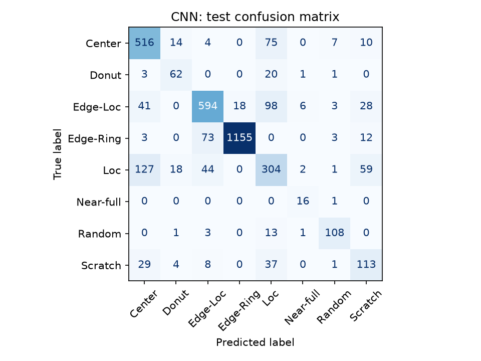
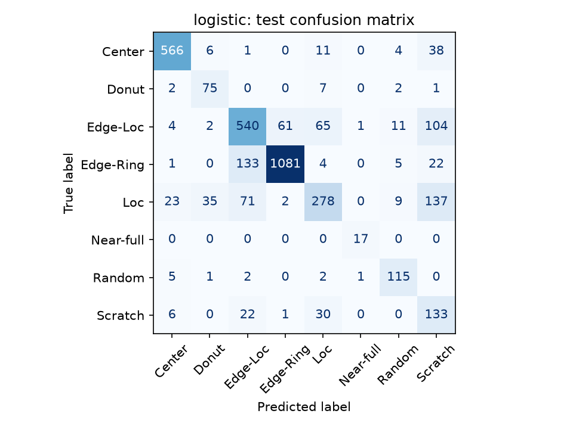
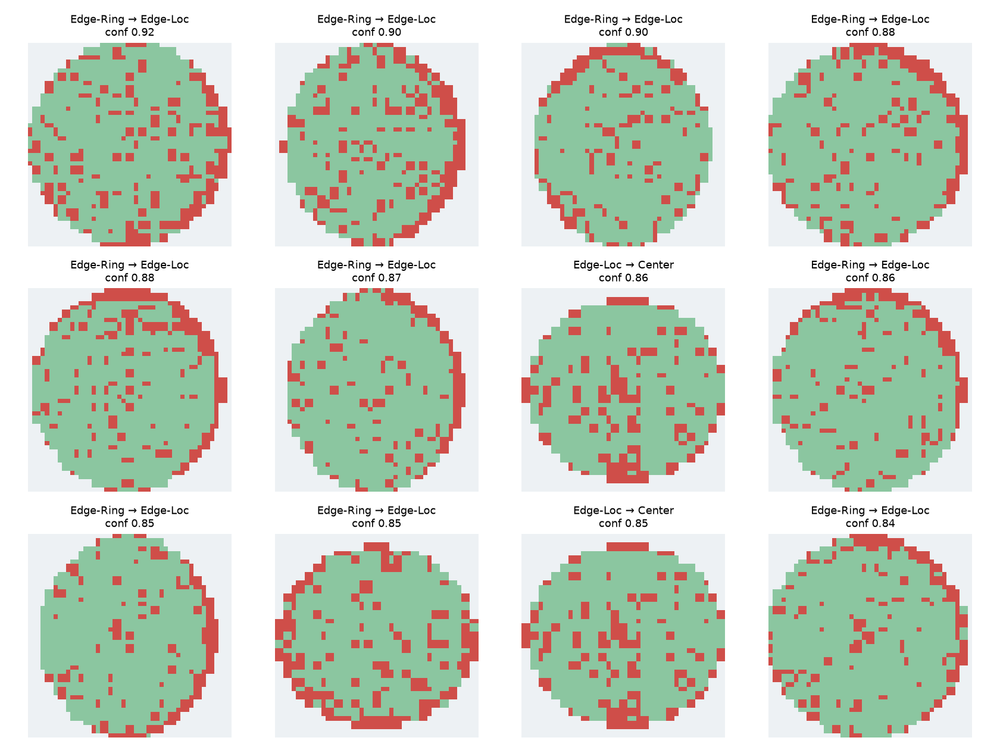

# Step 6 · 결함 패턴 분류: CNN과 특징 기반 기준선

## 평가 범위와 재현

WM-811K의 `Center`, `Donut`, `Edge-Loc`, `Edge-Ring`, `Loc`, `Near-full`, `Random`, `Scratch` **8개 결함 라벨**을 closed-set으로 분류했다. `none`과 미라벨 wafer는 제외했다. 따라서 아래 성능은 정상/결함 판별 능력을 뜻하지 않는다.

```powershell
.\.venv\Scripts\python.exe -m pip install -r requirements-step6.txt
.\.venv\Scripts\python.exe -m unittest discover -s tests -v
.\.venv\Scripts\python.exe -m src.models.step6_classify
```

- 원본 `data/raw/LSWMD.pkl` SHA-256: `1D04FCCB3DD3176B276878B926B20FEAD7E077C5751E4D353EA9741A5E7B5C65`.
- Python 3.12, PyTorch 2.14.0+cpu, scikit-learn 1.9.1, NumPy 2.3.5, pandas 3.0.1. 난수 시드 42, 학습 장치 CPU. 원본 lot 배정은 `data/processed/lot_split.csv`에 보관한다.
- 4단계의 lot 단위 train/validation/test 분할을 재사용했다. 원본 map의 크기와 모든 die 상태를 SHA-256으로 비교하여 **분할 간 정확히 같은 map**이 있으면 앞선 분할만 남겼다. Validation에서 15장, test에서 23장을 제거했다. 같은 분할 내부의 중복은 유지했다.

| Split | 결함 wafer 수 |
| :--- | ---: |
| train | 17,833 |
| validation | 4,011 |
| test | 3,637 |

CNN 입력은 원본 die 상태를 정사각형에 0으로 패딩하고 최근접 보간으로 48×48에 맞춘 뒤 pass/fail 2채널로 표현했다. 3개의 convolution 블록(16/32/64채널), global average pooling, 선형 분류기를 사용했다. Adam 학습률 0.001, 배치 128, 최대 8 epoch이며 **validation macro-F1이 가장 높은 7 epoch**의 체크포인트를 test에 적용했다(검증 macro-F1 0.741). 클래스 가중치는 train 빈도의 역제곱근으로 계산했다. 방향성 패턴을 바꿀 수 있는 회전·반전 증강은 적용하지 않았다.

기준선은 `fail_rate`와 4단계 공간 특징 11개를 사용하는 로지스틱 회귀다. 결측 대체·표준화·가중 로지스틱 회귀는 **train만**으로 적합했다. CNN과 기준선 모두 test는 최종 평가에만 사용했다.

## 테스트 결과

| 모델 | Macro-F1 | Accuracy | 추론 시간/wafer¹ |
| :--- | ---: | ---: | ---: |
| CNN | 0.734 | 0.789 | 0.263 ms |
| 특징 기반 로지스틱 회귀 | **0.755** | 0.771 | 0.0012 ms |

¹ CPU에서 준비된 입력을 배치 추론한 시간/장이다. 원본 pickle 로딩, map 변환, 특징 추출, 디스크 I/O는 제외했다. 두 모델의 입력과 전처리가 달라 이 수치만으로 전체 운영 지연을 비교할 수 없다.

| 결함 유형 (test 장수) | CNN precision | CNN recall | 기준선 precision | 기준선 recall |
| :--- | ---: | ---: | ---: | ---: |
| Center (626) | 0.718 | 0.824 | 0.932 | 0.904 |
| Donut (87) | 0.626 | 0.713 | 0.630 | 0.862 |
| Edge-Loc (788) | 0.818 | 0.754 | 0.702 | 0.685 |
| Edge-Ring (1,246) | 0.985 | 0.927 | 0.944 | 0.868 |
| Loc (555) | 0.556 | 0.548 | 0.700 | 0.501 |
| Near-full (17) | 0.615 | 0.941 | 0.895 | 1.000 |
| Random (126) | 0.864 | 0.857 | 0.788 | 0.913 |
| Scratch (192) | 0.509 | 0.589 | 0.306 | 0.693 |

CNN은 Edge-Loc·Edge-Ring에서 기준선보다 나았지만 전체 macro-F1은 기준선이 더 높았다. `Near-full`은 테스트가 17장뿐이라 지표의 변동성이 크다. `Loc`과 `Scratch`의 낮은 정밀도·재현율은 개선 과제다.







높은 확신의 오류 중 `Edge-Ring → Edge-Loc`이 반복된다. 두 라벨 모두 가장자리 결함을 포함해 경계가 모호할 수 있으나, 이 그림만으로 원본 라벨의 오류 여부는 판정할 수 없다. 클래스별 F1과 세부 수치는 [기계 판독형 지표](step6_metrics.json), 학습 곡선은 [epoch 기록](step6_training_history.csv), wafer별 결과는 [test 예측](step6_test_predictions.csv)에 있다.

## 한계와 후속 실험

- 48×48 축소는 가는 scratch나 국소 결함을 없앨 수 있다. 해상도·네트워크 크기·증강의 영향은 이번 단계에서 비교하지 않았다. ViT는 데이터 규모와 CPU 연산 비용을 고려해 실행하지 않았다.
- 분할 간 **완전 동일** map은 제거했지만 유사 중복은 검사하지 않았다. 같은 분할 내부 중복은 남아 있으므로 클래스별 유효 사례 수가 명목상 장수보다 적을 수 있다.
- `fail_rate`를 받는 기준선과 원본 map만 받는 CNN은 입력 정보가 다르다. 기준선의 우세를 아키텍처 자체의 우세로 해석해서는 안 된다.
- 단일 공개 데이터셋의 결함 라벨만 평가했다. 다른 공정·장비·시점 및 정상 wafer에 대한 일반화는 확인되지 않았다.

모델·전처리 체크포인트는 `data/processed/step6_cnn.pt`, `step6_logistic.joblib`에, 변환된 이미지 캐시는 `step6_labeled_maps.npz`에 로컬 보관한다. 큰 데이터 파일은 Git에 올리지 않는다.
