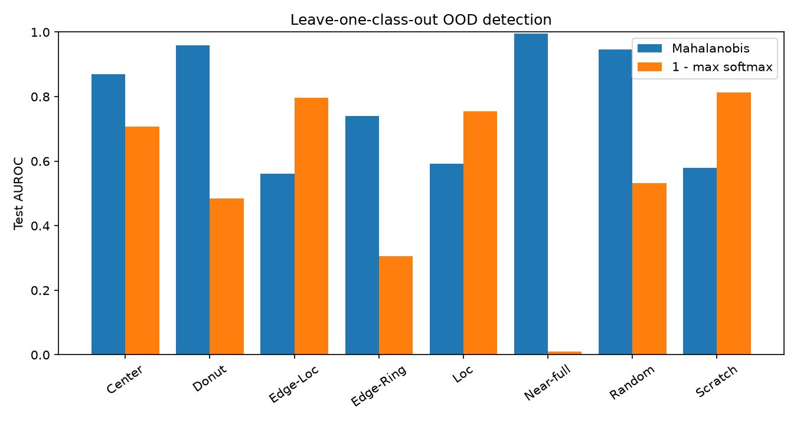

# Step 7 · 보류 결함 유형의 OOD 탐지

## 실험 설계와 재현

```powershell
.\.venv\Scripts\python.exe -m pip install -r requirements-step7.txt
.\.venv\Scripts\python.exe -m unittest discover -s tests -v
.\.venv\Scripts\python.exe -m src.evaluation.step7_ood
```

결함 라벨 8종을 하나씩 학습에서 완전히 보류했다. 각 실험에서 나머지 7종의 **train**만으로 결측 대체·표준화·가중 로지스틱 회귀를 적합한다. 같은 7종 train의 클래스 중심과 Ledoit–Wolf 수축 공분산(+ 대각선 ridge 0.01)으로 최소 Mahalanobis 제곱거리를 계산한다. 기준선은 같은 분류기의 `1 − 최대 softmax 확률`이다. 수율에 직접 대응하는 `fail_rate`와 4단계 공간 특징 11개가 두 방법의 공통 입력이다.

알려진 7종의 validation 점수 **95백분위수**를 각 실험·방법별 경보 임계값으로 정했다. 보류 유형의 validation 사례는 임계값 결정에 사용하지 않았다. Test에서 보류 유형은 양성, 나머지 7종은 음성이다. AUROC·AUPR과 FPR@95% TPR은 test 점수의 곡선 지표이며, 고정된 validation 임계값에서의 실제 경보율과 구분한다.

4단계 lot 분할을 유지하고 6단계의 원본 map 완전 중복 제거 규칙을 다시 적용했다(validation 15장, test 23장 제거). `none`·미라벨 wafer는 실험에 포함하지 않았다. 난수 시드는 42다. 원본 해시는 [6단계 보고서](step6_classification.md)에 있다.

## 실제 결과

| 방법 | 보류 8종 평균 AUROC | 평균 AUPR | 평균 FPR@95% TPR | 알려진 test 오경보율¹ | 보류 test 탐지율¹ |
| :--- | ---: | ---: | ---: | ---: | ---: |
| mahalanobis | 0.780 | 0.352 | 0.532 | 4.3% | 36.5% |
| one_minus_max_softmax | 0.551 | 0.191 | 0.749 | 5.9% | 11.4% |

¹ Validation의 알려진 유형 점수 95백분위수로 고정한 임계값에서 측정했다.

Mahalanobis는 평균 AUROC에서 기준선보다 높았지만 고정 임계값에서는 보류 패턴을 평균 36.5%만 검출했다. 특히 `Edge-Ring` 탐지율 0.5%, `Scratch` 0.0%로 실무 경보에 쓰기 어렵다. AUROC만으로 성공이라고 판단할 수 없다.

| 보류 유형 | Test 양성 장수 | Mahalanobis AUROC | AUPR | FPR@95% TPR | 알려진 오경보율 | 보류 탐지율 |
| :--- | ---: | ---: | ---: | ---: | ---: | ---: |
| Center | 626 | 0.870 | 0.602 | 0.569 | 5.0% | 49.2% |
| Donut | 87 | 0.959 | 0.353 | 0.120 | 4.1% | 65.5% |
| Edge-Loc | 788 | 0.562 | 0.273 | 0.954 | 4.4% | 8.5% |
| Edge-Ring | 1246 | 0.740 | 0.484 | 0.643 | 3.7% | 0.5% |
| Loc | 555 | 0.592 | 0.200 | 0.958 | 4.4% | 7.4% |
| Near-full | 17 | 0.996 | 0.496 | 0.019 | 4.4% | 100.0% |
| Random | 126 | 0.946 | 0.352 | 0.192 | 3.9% | 61.1% |
| Scratch | 192 | 0.579 | 0.059 | 0.798 | 4.1% | 0.0% |

전체 16개 실험의 임계값·표본 수·두 방법 지표는 [상세 CSV](step7_ood_metrics.csv)에 있다.




높은·낮은 novelty 점수의 실제 보류 wafer를 가장 쉬운 유형과 어려운 유형에서 각각 골랐다. [사례 인덱스](step7_ood_cases.csv)에 원본 행 번호를 기록했다.

## 품질 점검과 한계

- AUROC는 임계값 전체의 순위 품질이다. 운영 경보 기준에서는 위의 **보류 탐지율과 알려진 오경보율을 함께** 보아야 한다. `Near-full`처럼 test 표본이 작은 유형의 지표는 불안정하다.
- AUPR은 보류 유형의 test 비율에 영향을 받으므로 보류 유형 간 절댓값을 같은 난이도로 해석하면 안 된다. 표의 평균은 wafer 수 가중이 아닌 유형별 산술평균이다.
- 결함 유형 하나를 전부 제외한 **가상 신규 유형** 실험이다. 실제 미지의 공정 결함이 같은 특성 분포를 따르리라는 보장은 없다. `none`/미라벨 입력에 대한 오경보는 측정하지 않았다.
- 두 점수는 공간 요약 특징에 의존한다. 48×48 CNN 잠재 표현이나 원본 map 기반 거리와 비교하지 않았다. 분할 간 완전 동일 map은 제거했지만 유사 중복은 남을 수 있다.
- 5단계 HDBSCAN의 `noise`는 **train 표본의 밀도 기반 미할당**이고, 여기의 OOD 점수는 **보류 유형 test의 신규성**이다. 대상과 정의가 달라 동일하게 취급하지 않는다.
